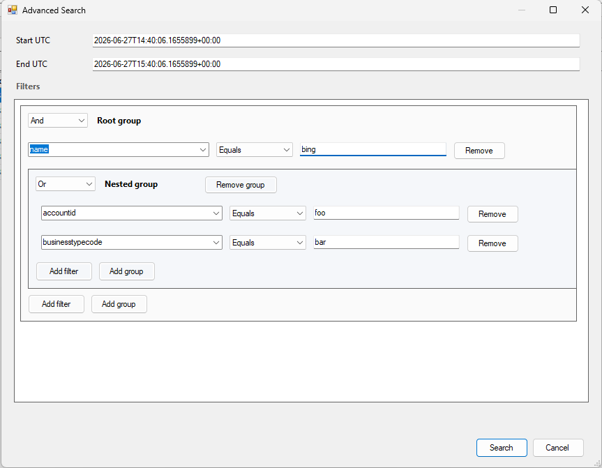

<p align="center">
  
</p>

# Flow Run Finder

Flow Run Finder is an XrmToolBox plugin for finding Power Automate flow runs and inspecting the related trigger data.

It is useful when you know a flow ran, but need to answer questions like:

- Which run handled this record?
- What trigger payload did the flow receive?
- Did any runs fire for this account, contact, row id, user id, status, or other trigger value?
- What happened during a specific UTC time window?
- Which trigger fields are worth comparing across recent runs?

This plugin hosts the shared `FlowRunFinderV2.Core` logic from [Flow Run Finder V2](https://github.com/johnyenter-briars/FlowRunFinderV2).

## Features

- Flow picker for searching and selecting cloud flows from the connected environment.
- Latest run history for the selected flow.
- Advanced UTC date-window search with nested `AND` / `OR` trigger input filters.
- Dataverse `flowrun` history table mode or Power Platform API mode.
- Dynamic trigger columns for showing trigger input/output values in the results grid.
- Run links to make.powerautomate.com, plus right-click copy behavior.
- Configurable authentication flow, plus Dataverse and Power Automate public client IDs.
- Local token caching and daily logs under the plugin's app data folder.

## Screenshots





## Setting Up A Connection

Connect XrmToolBox to your Dataverse / Dynamics 365 environment as normal, then open **Flow Run Finder** from the plugin list.

The plugin uses the active XrmToolBox connection only to identify the environment URL. It does **not** use the native XrmToolBox connection token for Core operations.

Authentication for Dataverse and Power Automate is handled by `FlowRunFinderV2.Core` through Microsoft interactive browser or device-code authentication and local MSAL token caching. This is intentional because the plugin depends on the same Core authentication model used by Flow Run Finder V2.

## Using The Tool

After opening the plugin, click **Reload Flows** to authenticate and load cloud flows from the connected environment.

Select a cloud flow from the flow picker, then click **Refresh Runs** to load recent runs. The grid shows run timing, status, run id, links, and selected trigger columns.

Use **Trigger Columns** to choose which trigger fields should appear in the grid. The list is based on trigger payloads returned for loaded runs, so it can include custom Dataverse columns and dynamic trigger values.

Use **Advanced Search** when recent runs are not enough. Set a local start and end date/time, then add filters against trigger input values. Filters can be grouped with nested `AND` and `OR` logic.

The advanced search date/time controls use local date and time inputs, then convert the selected values to UTC for the run query.

Click a run id to open the run in Power Automate. Right-click a run id to copy the run URL, or right-click another grid cell to copy that value.

## Settings

The settings screen supports:

- Default run count
- Max runs to query
- Flow run history table toggle
- Authentication flow
- Dataverse client ID
- Power Automate client ID
- Log verbosity

The flow run history table toggle controls whether run queries use the Dataverse `flowrun` table or the Power Platform API.

## Local Files

The plugin keeps its local data here:

```text
%LOCALAPPDATA%\FlowRunFinder
```

Notable files and folders:

- `settings.json`: plugin settings and selected trigger columns
- `connections`: per-environment token caches
- `logs`: daily log files

Token cache files are stored per environment connection under:

```text
%LOCALAPPDATA%\FlowRunFinder\connections\<connection-guid>\
```

Device-code cache files are stored under:

```text
%LOCALAPPDATA%\FlowRunFinder\connections\<connection-guid>\auth\devicecode\
```

Interactive browser cache files are stored under:

```text
%LOCALAPPDATA%\FlowRunFinder\connections\<connection-guid>\auth\interactivebrowser\
```

To force re-authentication, delete the relevant auth cache folder under `%LOCALAPPDATA%\FlowRunFinder\connections`.

## Installation

1. Open **XrmToolBox**.
2. Click **Plugin Store** in the toolbar.
3. Search for **Flow Run Finder**.
4. Click **Install**.
5. Restart XrmToolBox.

## Requirements

- [XrmToolBox](https://www.xrmtoolbox.com) v1.2025.10.74 or later
- A Power Automate / Power Platform environment
- Internet access for Dataverse, the Power Automate REST API, and first-time interactive browser or device-code authentication

## Development

This project depends on `FlowRunFinderV2.Core` from the [Flow Run Finder V2 repo](https://github.com/johnyenter-briars/FlowRunFinderV2).

For local builds, the Flow Run Finder V2 repo must be downloaded locally at the relative path referenced by the project file, and the Core DLL must already exist under the V2 Core build output:

```text
..\..\..\FlowRunFinderV2\src\FlowRunFinderV2\FlowRunFinderV2.Core\bin\Debug\netstandard2.0\FlowRunFinderV2.Core.dll
```

That direct DLL reference is intentional for now. If the V2 Core project changes, rebuild `FlowRunFinderV2.Core` first so this XrmToolBox plugin picks up the updated API surface.

Release packaging uses ILRepack to merge `FlowRunFinderV2.Core.dll` into `FlowRunFinder.dll`.

| Component | Description |
| --- | --- |
| `FlowRunFinder` | XrmToolBox `net48` plugin UI and host integration. |
| `FlowRunFinderV2.Core` | Shared .NET Standard 2.0 application logic for auth, clients, settings, logging, models, and query behavior. |

## AI Disclosure

- AI-assisted tooling was used in the development of this codebase.

## License

- License: [MIT](LICENSE)
